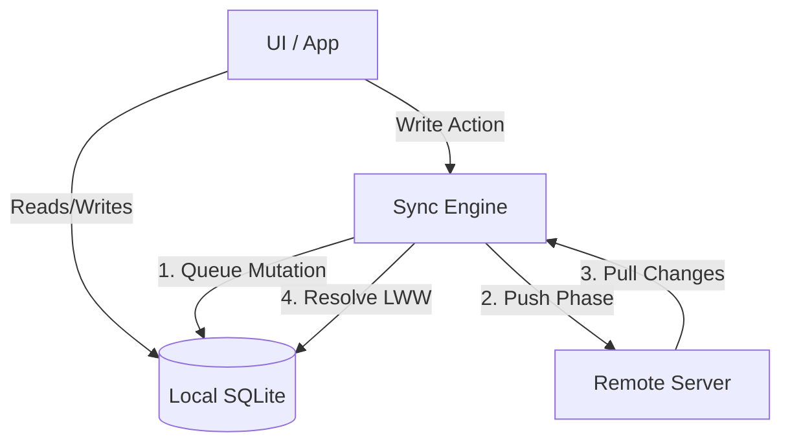

# Offline-First Sync Engine

A generic sync engine demonstrating offline-first architecture using local SQLite and Drizzle ORM.

## Features

- **Mutation Queue:** All local creates, updates, and deletes are instantly recorded in a `sync_mutations` queue.
- **Push Phase:** Batches pending mutations and sends them to the remote API. Upon success, clears the queue and marks items as `synced`.
- **Pull Phase:** Fetches remote changes since the last sync timestamp.
- **Conflict Resolution:** Implements a strict Last-Write-Wins (LWW) strategy based on `updated_at` timestamps to safely merge remote changes over local states.

## Tech Stack

- **Drizzle ORM** for schema definition and type-safe querying.
- **Better-SQLite3** for fast, synchronous local data operations.
- **Vitest** for testing the conflict resolution algorithm.

## Testing

```bash
npm install
npm test
```

## Architecture



## License
MIT

